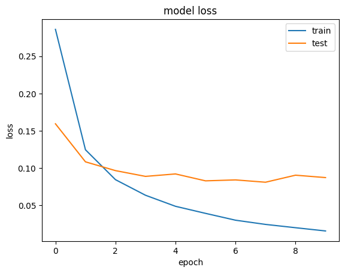

# Hand digit classifier using ANN

 

Develop a Digit Recognizer using the concepts of Deep Learning. I Study and learn the basics of Machine Learning and Deep Learning algorithms along with the understanding of the most primitive but effective Optimization algorithm which is Gradient Descent and it's application to Single Node, Multi Node and even Multi Hidden Layer networks. 

Digit classifier is implemented using Multi Layer Perceptron containing a single hidden layer with 128 Nodes using ReLU Activation and an Output Layer with 10 Nodes using SoftMax Activation.

 ### Learning curves

   

 
Digital pad is a model developed to facilitate the user in drawing white digits onto a black Drawing Pad of 28x28pixels by using the mouse events available in OpenCV and then resizing the image to 28x28pixels and passing it to the trained ANN model for classification.

